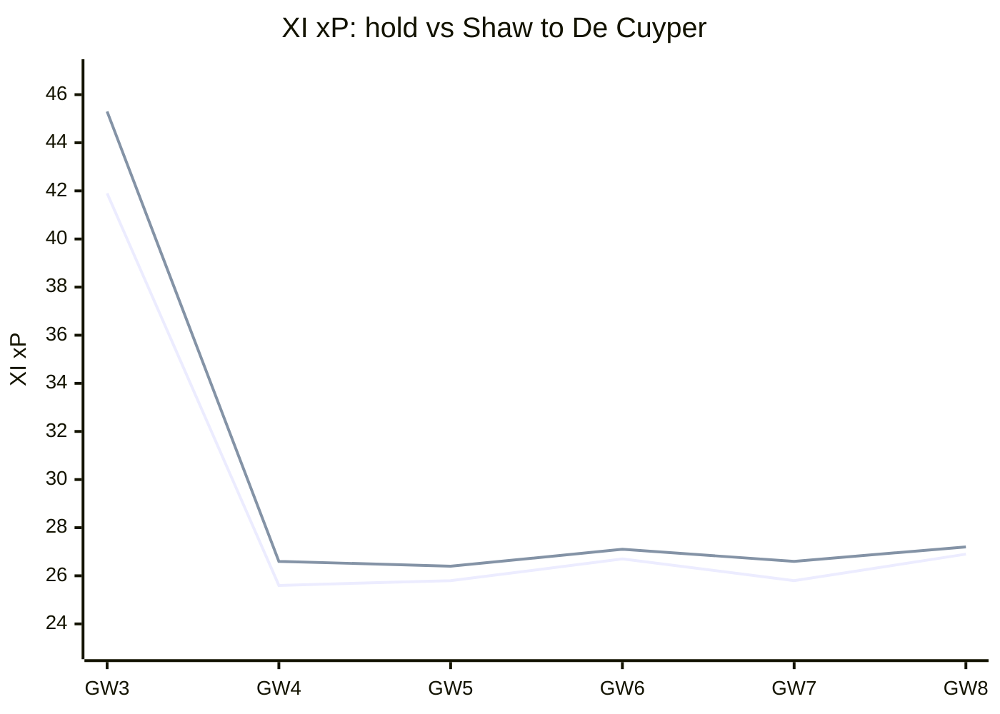
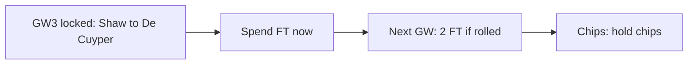
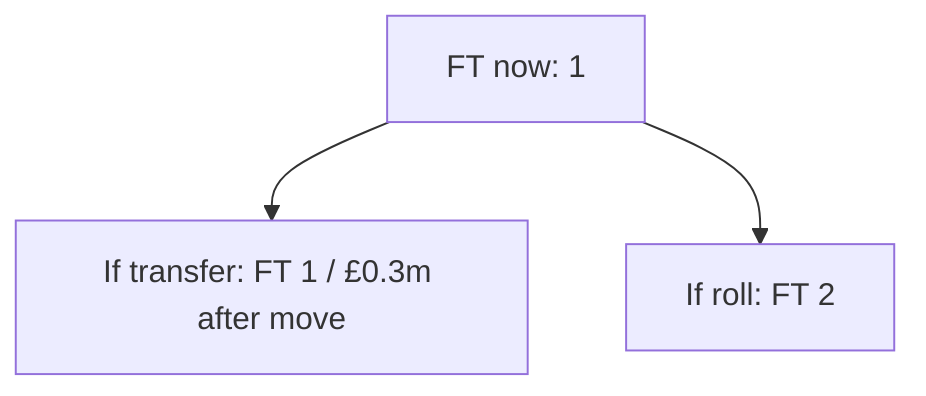

# Season plan — Gameweek 3

Locked move: **Shaw → De Cuyper** (plan **REVISE**).

## Why this move over the next weeks

Selling **Shaw** for **De Cuyper** changes the XI projection across the planning horizon (GW3 +3.4, GW4 +1.0, GW5 +0.6, GW6 +0.5, GW7 +0.9, GW8 +0.3; +5.7 weighted overall). Adds +3.4 pts to the XI this GW and keeps paying later (GW4 +1.0, GW5 +0.6, GW6 +0.5; +5.7 weighted overall).

| GW | Hold XI xP | After XI xP | Delta |
| --- | ---: | ---: | ---: |
| 3 | 41.89 | 45.27 | +3.38 |
| 4 | 25.65 | 26.63 | +0.98 |
| 5 | 25.75 | 26.37 | +0.62 |
| 6 | 26.66 | 27.11 | +0.45 |
| 7 | 25.75 | 26.64 | +0.90 |
| 8 | 26.90 | 27.21 | +0.31 |

## Spend now vs bank the free transfer

**Bank vs spend verdict: Spend the FT now.** Spend the FT: +5.6 horizon xP clears the bar (+3.4 this GW). Rolling would bank 2 FT next GW but forego this edge. Net after FT-banking cost (~0.3): +5.2. (FT now 1 → 1 if you transfer, 2 if you roll; flat FT-bank option cost ~0.35; deferred dual-move upside +4.49; net after FT penalty +5.25; locked pick Shaw→De Cuyper.)

## Bank and value after the move

The locked swap sells at £4.5m and buys at £4.7m, leaving **£0.3m** in the bank. Free transfers after acting: 1; after rolling: 2. Future affordability is this residual bank plus selling prices — not a forecast of price changes.

## Confirmed DGW / BGW in the horizon

No confirmed DGW/BGW strip was attached to this report (fixtures-feed calendar is surfaced when present). Any unscheduled windows must be labelled priors — never shown as confirmed.

_No confirmed fixture-calendar rows to chart._

## DGW / BGW priors (not confirmed)

No labelled DGW/BGW priors on this report (none invented by default).

## Chip timing

**3xc**: hold (available) — Captain mean xP 7.47 lacks ceiling for TC (haul proxy 0.00, need ≥0.25); hold until a genuine haul week (DGW detection pending). **bboost**: hold (available) — Bench xP 2.32 (need ≥8) or outfield start risk (min 10%) is not enough to spend Bench Boost. **freehit**: hold (available) — This week's XI xP 41.9 is close enough to the horizon median 25.8; hold Free Hit. **wildcard**: hold (available) — Only 0 XI player(s) have start chance below 40%; keep Wildcard.

_Recommend only — you make all FPL changes. Numbers from the locked weekly primary; no second ranking._
