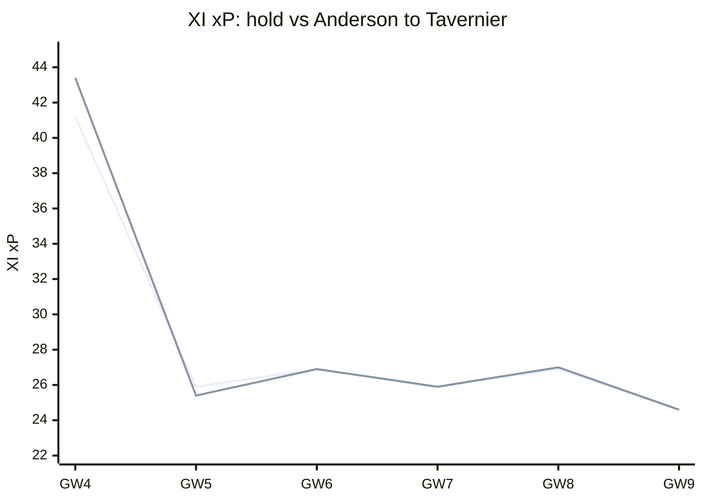
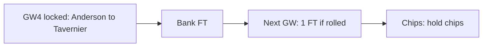
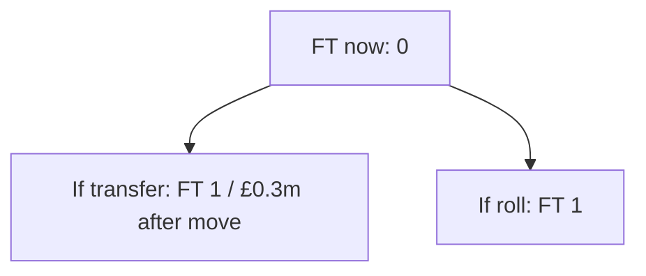
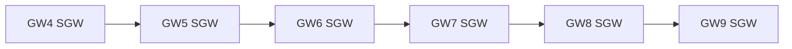

# Season plan — Gameweek 4

Locked move: **Anderson → Tavernier** (plan **REVISE**).

## Why this move over the next weeks

Selling **Anderson** for **Tavernier** changes the XI projection across the planning horizon (GW4 +2.2, GW5 -0.5, GW6 +0.0, GW7 +0.0, GW8 +0.0, GW9 +0.0; +1.8 weighted overall). Mainly a this-week fix (+2.2 pts now; +1.8 weighted overall).

| GW | Hold XI xP | After XI xP | Delta |
| --- | ---: | ---: | ---: |
| 4 | 41.20 | 43.36 | +2.16 |
| 5 | 25.91 | 25.45 | -0.46 |
| 6 | 26.85 | 26.85 | +0.00 |
| 7 | 25.91 | 25.91 | +0.00 |
| 8 | 26.95 | 26.96 | +0.00 |
| 9 | 24.60 | 24.60 | +0.00 |

## Spend now vs bank the free transfer

**Bank vs spend verdict: Bank the FT.** No affordable move clears the horizon EV bar; banking FT preserves optionality. (FT now 0 → 1 if you transfer, 1 if you roll; sequence bank_for_2ft (act-now 0.0, roll-to-2FT 5.08, hit None); net after FT penalty +0.00; locked pick Anderson→Tavernier.)

## Bank and value after the move

The locked swap sells at £6.3m and buys at £6.0m, leaving **£0.3m** in the bank. Free transfers after acting: 1; after rolling: 1. Future affordability is this residual bank plus selling prices — not a forecast of price changes.

## Confirmed DGW / BGW in the horizon

Confirmed fixtures in horizon (GW4, GW5, GW6, GW7, GW8, GW9): no DGW/BGW flags from the feed.

## DGW / BGW priors (not confirmed)

No labelled DGW/BGW priors on this report (none invented by default).

## Chip timing

**3xc**: hold (available) — Captain mean xP 4.82 lacks ceiling for TC (haul proxy 0.00, need ≥0.25); hold until a genuine haul week (DGW detection pending). **bboost**: hold (available) — Bench xP 2.70 (need ≥8) or outfield start risk (min 10%) is not enough to spend Bench Boost. **freehit**: hold (available) — This week's XI xP 41.2 is close enough to the horizon median 25.9; hold Free Hit. **wildcard**: hold (available) — Squad health (0 of 11 starters below 40% start chance), fixture trend (26.4 avg pts near-term vs 25.8 avg further out), and transfer-plan value (best plan nets +0.0 horizon pts after hits) all look fine; keep Wildcard.

_Recommend only — you make all FPL changes. Numbers from the locked weekly primary; no second ranking._
