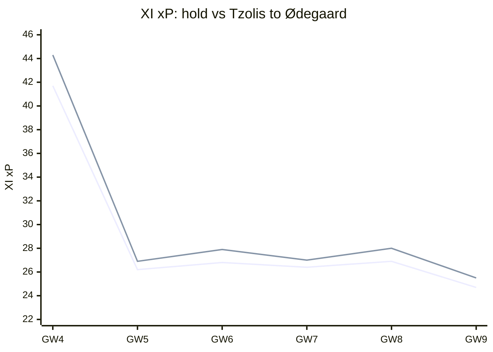
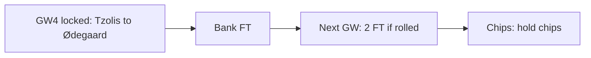
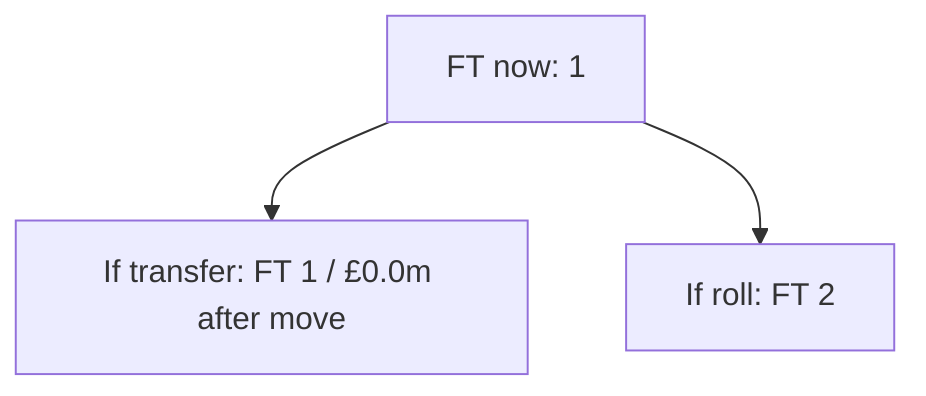
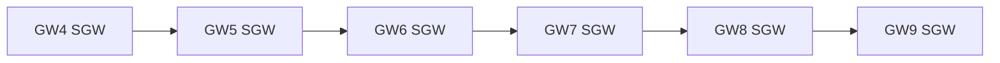

# Season plan — Gameweek 4

Locked move: **Tzolis → Ødegaard** (plan **REVISE**).

## Why this move over the next weeks

Selling **Tzolis** for **Ødegaard** changes the XI projection across the planning horizon (GW4 +2.5, GW5 +0.7, GW6 +1.1, GW7 +0.6, GW8 +1.1, GW9 +0.8; +5.4 weighted overall). Adds +2.5 pts to the XI this GW and keeps paying later (GW5 +0.7, GW6 +1.1, GW7 +0.6; +5.4 weighted overall).

| GW | Hold XI xP | After XI xP | Delta |
| --- | ---: | ---: | ---: |
| 4 | 41.73 | 44.29 | +2.55 |
| 5 | 26.20 | 26.89 | +0.69 |
| 6 | 26.77 | 27.92 | +1.15 |
| 7 | 26.44 | 26.99 | +0.55 |
| 8 | 26.93 | 28.02 | +1.09 |
| 9 | 24.70 | 25.49 | +0.78 |

## Spend now vs bank the free transfer

**Bank vs spend verdict: Bank the FT.** Bank the FT (1→2 next GW). Bank for 2 FT: dual-move horizon EV 7.4 beats act-now 4.1 (delta +3.2). (FT now 1 → 1 if you transfer, 2 if you roll; sequence bank_for_2ft (act-now 4.147, roll-to-2FT 7.364, hit None); deferred dual-move upside +3.22; net after FT penalty +3.80; locked pick Tzolis→Ødegaard.)

## Bank and value after the move

The locked swap sells at £6.4m and buys at £6.7m, leaving **£0.0m** in the bank. Free transfers after acting: 1; after rolling: 2. Future affordability is this residual bank plus selling prices — not a forecast of price changes.

## Confirmed DGW / BGW in the horizon

Confirmed fixtures in horizon (GW4, GW5, GW6, GW7, GW8, GW9): no DGW/BGW flags from the feed.

## DGW / BGW priors (not confirmed)

No labelled DGW/BGW priors on this report (none invented by default).

## Chip timing

**3xc**: hold (available) — Captain mean xP 5.98 lacks ceiling for TC (haul proxy 0.00, need ≥0.25); hold until a genuine haul week (DGW detection pending). **bboost**: hold (available) — Bench xP 2.82 (need ≥8) or outfield start risk (min 10%) is not enough to spend Bench Boost. **freehit**: hold (available) — This week's XI xP 41.7 is close enough to the horizon median 26.4; hold Free Hit. **wildcard**: hold (available) — Only 0 XI player(s) have start chance below 40%; keep Wildcard.

_Recommend only — you make all FPL changes. Numbers from the locked weekly primary; no second ranking._
