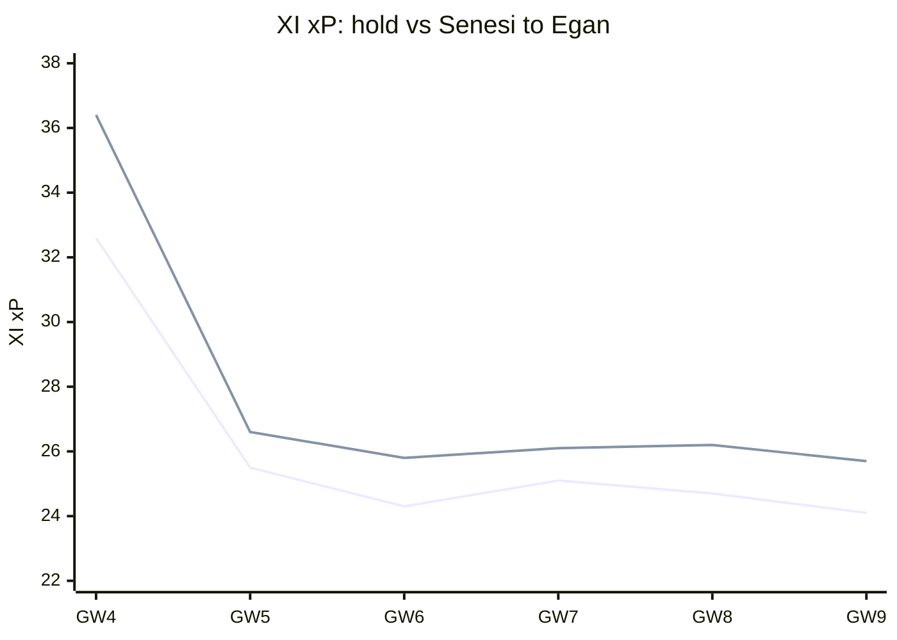
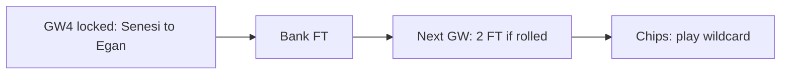
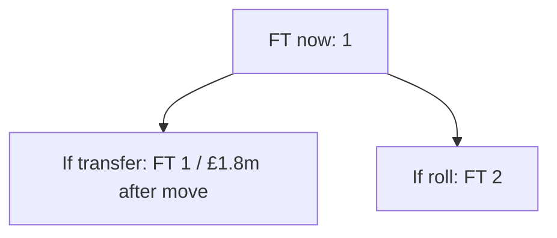
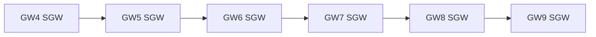

# Season plan — Gameweek 4

Locked move: **Senesi → Egan** (plan **REVISE**).

## Why this move over the next weeks

Selling **Senesi** for **Egan** changes the XI projection across the planning horizon (GW4 +3.8, GW5 +1.1, GW6 +1.5, GW7 +1.0, GW8 +1.5, GW9 +1.6; +8.2 weighted overall). Adds +3.8 pts to the XI this GW and keeps paying later (GW5 +1.1, GW6 +1.5, GW7 +1.0; +8.2 weighted overall).

| GW | Hold XI xP | After XI xP | Delta |
| --- | ---: | ---: | ---: |
| 4 | 32.61 | 36.44 | +3.83 |
| 5 | 25.53 | 26.65 | +1.11 |
| 6 | 24.29 | 25.82 | +1.52 |
| 7 | 25.07 | 26.07 | +1.00 |
| 8 | 24.70 | 26.22 | +1.52 |
| 9 | 24.06 | 25.68 | +1.62 |

## Spend now vs bank the free transfer

**Bank vs spend verdict: Bank the FT.** Bank the FT (1→2 next GW). Bank for 2 FT: dual-move horizon EV 11.2 beats act-now 8.2 (delta +2.9). (FT now 1 → 1 if you transfer, 2 if you roll; sequence bank_for_2ft (act-now 8.245, roll-to-2FT 11.19, hit 6.321); deferred dual-move upside +2.94; net after FT penalty +7.89; locked pick Senesi→Egan.)

## Bank and value after the move

The locked swap sells at £5.9m and buys at £4.1m, leaving **£1.8m** in the bank. Free transfers after acting: 1; after rolling: 2. Future affordability is this residual bank plus selling prices — not a forecast of price changes.

## Confirmed DGW / BGW in the horizon

Confirmed fixtures in horizon (GW4, GW5, GW6, GW7, GW8, GW9): no DGW/BGW flags from the feed.

## DGW / BGW priors (not confirmed)

No labelled DGW/BGW priors on this report (none invented by default).

## Chip timing

**3xc**: hold (available) — Captain mean xP 3.89 lacks ceiling for TC (haul proxy 0.00, need ≥0.25); hold until a genuine haul week (DGW detection pending). **bboost**: hold (available) — Bench xP 0.67 (need ≥8) or outfield start risk (min 0%) is not enough to spend Bench Boost. **freehit**: hold (available) — This week's XI xP 32.6 is close enough to the horizon median 24.7; hold Free Hit. **wildcard**: play (available) — even the best 2-transfer plan still nets +6.3 horizon pts after hits. That combination points to a rebuild, not a one-week Free Hit.

_Recommend only — you make all FPL changes. Numbers from the locked weekly primary; no second ranking._
