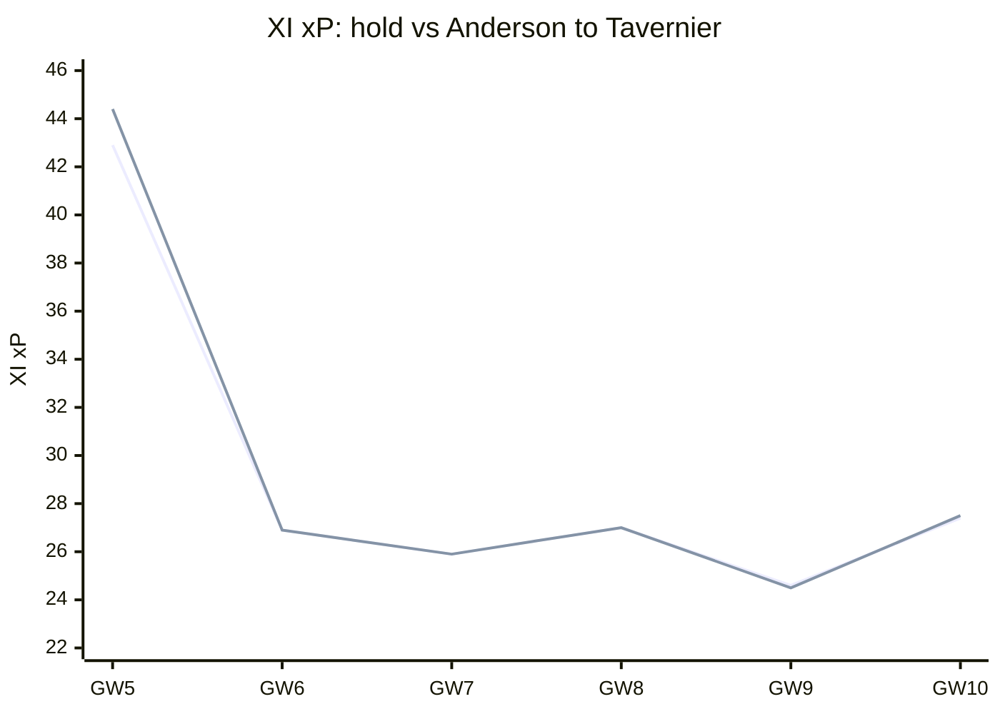
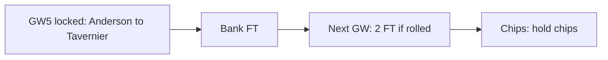
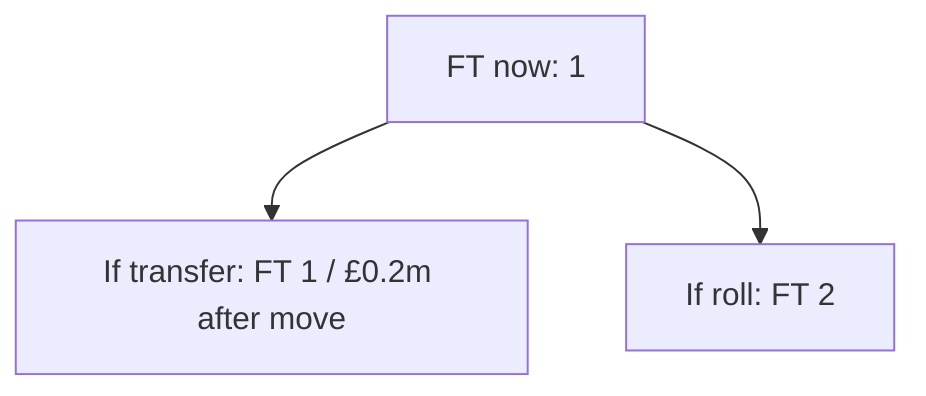
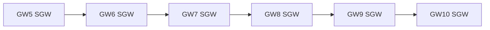

# Season plan — Gameweek 5

Locked move: **Anderson → Tavernier** (plan **KEEP**).

## Why this move over the next weeks

Selling **Anderson** for **Tavernier** changes the XI projection across the planning horizon (GW5 +1.5, GW6 -0.1, GW7 -0.1, GW8 -0.1, GW9 -0.1, GW10 +0.1; +1.4 weighted overall). Mainly a this-week fix (+1.5 pts now; +1.4 weighted overall).

| GW | Hold XI xP | After XI xP | Delta |
| --- | ---: | ---: | ---: |
| 5 | 42.91 | 44.44 | +1.52 |
| 6 | 26.95 | 26.89 | -0.06 |
| 7 | 25.95 | 25.87 | -0.08 |
| 8 | 27.04 | 26.98 | -0.06 |
| 9 | 24.58 | 24.50 | -0.08 |
| 10 | 27.40 | 27.53 | +0.12 |

## Spend now vs bank the free transfer

**Bank vs spend verdict: Bank the FT.** Bank the FT (1→2 next GW). Bank for 2 FT: dual-move horizon EV 5.3 beats act-now 2.0 (delta +3.3). (FT now 1 → 1 if you transfer, 2 if you roll; sequence bank_for_2ft (act-now 1.973, roll-to-2FT 5.306, hit None); deferred dual-move upside +3.33; net after FT penalty +1.62; locked pick Anderson→Tavernier.)

## Bank and value after the move

The locked swap sells at £6.3m and buys at £6.1m, leaving **£0.2m** in the bank. Free transfers after acting: 1; after rolling: 2. Future affordability is this residual bank plus selling prices — not a forecast of price changes.

## Confirmed DGW / BGW in the horizon

Confirmed fixtures in horizon (GW5, GW6, GW7, GW8, GW9, GW10): no DGW/BGW flags from the feed.

## DGW / BGW priors (not confirmed)

No labelled DGW/BGW priors on this report (none invented by default).

## Chip timing

**3xc**: hold (available) — Captain mean xP 4.59 lacks ceiling for TC (haul proxy 0.00, need ≥0.25); hold until a genuine haul week (DGW detection pending). **bboost**: hold (available) — Bench xP 2.56 (need ≥8) or outfield start risk (min 10%) is not enough to spend Bench Boost. **freehit**: hold (available) — This week's XI xP 42.9 is close enough to the horizon median 26.9; hold Free Hit. **wildcard**: hold (available) — Squad health (0 of 11 starters below 40% start chance), fixture trend (26.4 projected XI pts near-term vs 26.3 further out), and transfer-plan value (best plan nets +2.0 horizon pts after hits) all look fine; keep Wildcard.

_Recommend only — you make all FPL changes. Numbers from the locked weekly primary; no second ranking._
